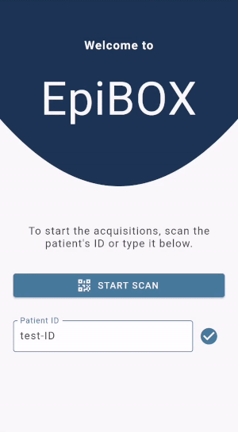
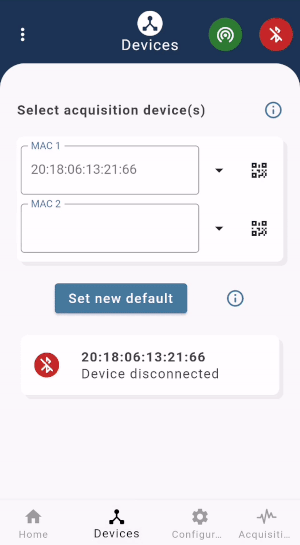
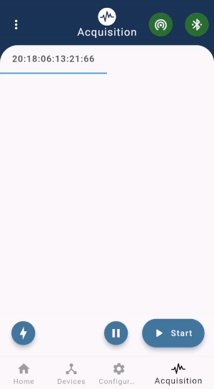

# EpiBOX, the Python package
## A Research Tool to Stimulate Collaboration Within Biosignal Collection

EpiBOX was developed as a way to enable researchers to escalate their data collection process by leveraging the human resources available. By providing a versatile, discreet, user-friendly and open-source system, operated through a mobile application, we hope to provide a collaboration tool for the acquisition of biosignals.

Designed for use with a Raspberry Pi due to its unobtrusive design (but usable with any Linux device), it acts as an autonomous recording unit - allowing for sensor connectivity and data storage. EpiBOX mobile app provides the user interface and the near-real time visualization of the data. 

Currently, EpiBOX supports BITalino-based equipments allowing for the recording, storage and visualization of up to 12 channels simmultaneously. Nevertheless, this package can be easily integrated with other sensors, as long as a Python API is provided!

## Requirements

 - This Python package is complementary the mobile app EpiBOX (available at [EpiBOX](https://github.com/anascacais/epibox_app));
 - It also requires a Raspberry Pi set up as a wireless access point and MQTT broker in order to ensure communication between the mobile app and the recording unit (RPi itself or another Linux device).

## Installation

Use the package manager [pip](https://pip.pypa.io/en/stable/) to install epibox.

```bash
pip install epibox
or 
pip install --upgrade epibox
```

## Usage

```bash 
# this will initiate the process - which should be continued by the user interface (EpiBOX app)
python -m epibox
```

## Features

- Step-by-step interactions to start the acquisition
- History of acquisition devices
- Default configurations for optimized interaction
- Real-time visualization of up-to 12 channels
- In-acquisition annotations

  

## Additional Resources

Why BITalino: 
 - Versatility of sensors & flexibility of wearable form-factors
 - Rapid & cheap prototyping
 - Peer-validated against gold-standards

Why Raspberry Pi:
 - Discreteness
 - Affordability 
 - Ease of system replication - through shell script or RPi imager
 - Computational and storage power

Get to know our project @ [LinkedIn - PreEpiSeizures](https://www.linkedin.com/feed/update/urn:li:activity:6787017108631941120/)


## License

MIT

## Contact

For any additional information about the mobile app or our project please contact me: anascacais@gmail.com